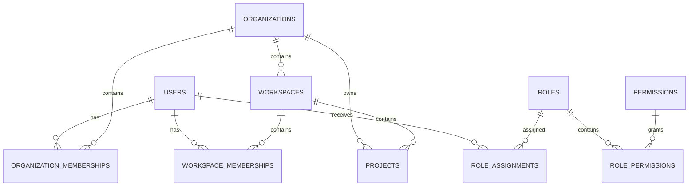

# Batch 1 Data Model

## Tenant hierarchy

`Organization -> Workspace -> Project`

Projects store both `organization_id` and `workspace_id`. The initial migration adds a composite foreign key so a project cannot reference a workspace belonging to a different organization.

## System roles seeded

- SUPER_ADMIN
- ADMIN
- SUB_ADMIN
- OWNER
- MEMBER

SUPER_ADMIN receives every Batch 1 permission. OWNER receives the tenant permissions needed to manage workspaces and projects. MEMBER is read-oriented. ADMIN and SUB_ADMIN are intentionally not granted implicit permissions in Batch 1; their permissions should be explicitly configured rather than guessed.

## Batch 1 permissions

- `user.read`
- `organization.read`
- `workspace.read`
- `workspace.create`
- `project.create`
- `project.read`
- `project.update`
- `project.delete`
- `admin.role.manage`
- `admin.access.manage`
- `audit.read`
